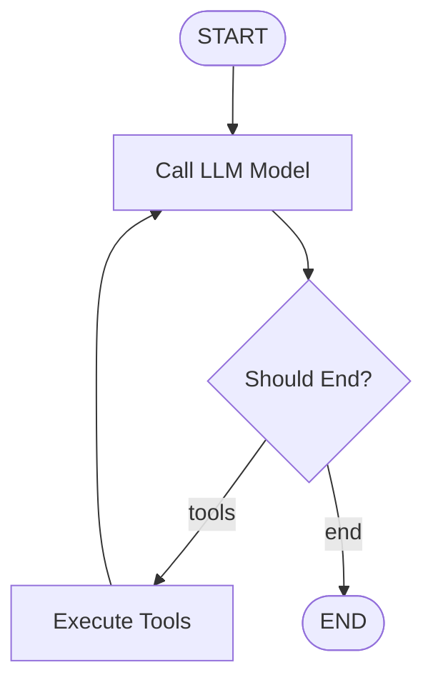

# ReAct Agent Integration for Simple MCP Client

This document provides a detailed overview of the ReAct agent integration in the Simple MCP Client, explaining its architecture, implementation details, and usage.

## Table of Contents

1. [Overview](#overview)
2. [Architecture](#architecture)
3. [Key Components](#key-components)
4. [Features in Detail](#features-in-detail)
5. [Configuration Options](#configuration-options)
6. [Usage Examples](#usage-examples)
7. [Technical Implementation](#technical-implementation)

## Overview

The ReAct (Reasoning and Acting) agent integration enhances the chat functionality of the MCP client by providing intelligent tool selection and reasoning capabilities. This implementation leverages LangGraph's ReAct agent pattern to enable more sophisticated interactions with MCP servers and their tools.

The integration brings several key improvements:

- **Intelligent tool reasoning and selection**
- **Multi-step problem solving**
- **Enhanced visualization of agent thought processes**
- **Improved error handling and timeout management**
- **Seamless integration with existing MCP servers**

## Architecture

The ReAct agent integration follows a modular architecture that consists of three main components:

1. **ReactAgentProvider**: Implements the LangGraph ReAct agent, manages LLM initialization, and handles tool binding.
2. **MCPLangChainAdapter**: Bridges existing MCP servers with LangChain's MultiServerMCPClient, handling server configuration conversion and tool management.
3. **Chat Utilities**: Provides modular functions for chat initialization, display formatting, and resource cleanup.

### Integration Flow

```
User Input → ReAct Agent → Tool Selection → Tool Execution → Response Generation
     ↑                                                              ↓
     └─────────────── Enhanced Chat Loop ──────────────────────────┘
```

### LangGraph Structure

The ReAct agent uses LangGraph's StateGraph to manage the agent's reasoning and tool execution flow. Here's a visualization of the graph structure:



The graph works as follows:

1. **START**: The entry point of the graph
2. **call_model**: Calls the language model with the current messages and bound tools
3. **Should End?**: Determines whether to continue with tool execution or end the conversation
   - If the message contains tool calls: route to "tools"
   - If the message is a regular response: route to "END"
4. **Execute Tools**: Executes the requested tools and adds their results to the conversation
5. **END**: The exit point of the graph

This cycle continues until the agent decides to end the conversation or reaches the maximum number of iterations.

## Key Components

### 1. ReactAgentProvider

The `ReactAgentProvider` class (`simple_mcp_client/llm/react_agent.py`) is the core component of the ReAct integration. It:

- Initializes the language model based on the client configuration
- Creates a LangGraph StateGraph for the ReAct agent
- Manages tool binding and execution
- Provides both streaming and non-streaming response modes
- Handles timeout and iteration limits

Key methods:
- `initialize()`: Sets up the LLM and creates the ReAct agent graph
- `_create_react_graph()`: Creates the LangGraph StateGraph
- `get_response()`: Gets a complete response from the agent
- `stream_response()`: Streams the agent's response, including tool calls and results

### 2. MCPLangChainAdapter

The `MCPLangChainAdapter` class (`simple_mcp_client/mcp/langchain_adapter.py`) bridges the existing MCP server infrastructure with LangChain's MCP adapters. It:

- Converts server configurations to the format expected by MultiServerMCPClient
- Initializes the LangChain MCP client with connected servers
- Retrieves and caches tools from connected servers
- Provides methods to refresh tools and manage server connections

Key methods:
- `initialize_langchain_client()`: Sets up the LangChain MCP client
- `get_tools()`: Retrieves tools from connected servers
- `refresh_tools()`: Refreshes the tool cache

### 3. Chat Utilities

The chat utilities (`simple_mcp_client/console/chat_utils.py`) provide helper functions for the chat command. They:

- Initialize the MCP client and ReAct agent
- Format and display tool executions
- Parse streaming chunks from the agent
- Manage the chat loop and user interactions
- Clean up resources when the chat session ends

Key functions:
- `initialize_mcp_client()`: Sets up the MCP LangChain adapter
- `create_react_agent()`: Creates and initializes the ReAct agent
- `run_chat_loop()`: Manages the main chat interaction loop
- `parse_streaming_chunk()`: Parses chunks from the streaming response
- `format_tool_execution_display()`: Formats tool executions for display

## Features in Detail

### 1. Intelligent Tool Reasoning

The ReAct agent uses a reasoning process to determine which tools to use and when. This enables:

- **Context-aware tool selection**: The agent considers the conversation history and user request when selecting tools
- **Multi-step reasoning**: The agent can break down complex tasks into simpler steps
- **Tool chaining**: The agent can use the output of one tool as input to another
- **Dynamic adaptation**: The agent can adjust its approach based on intermediate results

Implementation details:
- Uses LangGraph's StateGraph to manage the agent's state
- Implements a decision function (`should_end()`) to determine when to continue with tools or end the conversation
- Binds tools to the model dynamically based on available MCP servers

### 2. LangChain MCP Integration

The integration with LangChain's MCP adapters provides:

- **Unified tool interface**: Consistent access to tools across different MCP servers
- **Automatic tool discovery**: Tools are automatically discovered and made available to the agent
- **Server configuration conversion**: Existing server configurations are converted to the format expected by LangChain
- **Tool caching**: Tools are cached to improve performance

Implementation details:
- Converts server configurations from the client's format to LangChain's format
- Initializes MultiServerMCPClient with connected servers
- Caches tools to avoid repeated calls to servers

### 3. Enhanced Chat Experience

The chat experience is enhanced with:

- **Clear visualization of agent reasoning**: The agent's thought process is displayed to the user
- **Detailed tool execution information**: Tool name, arguments, and results are clearly formatted
- **Streaming responses**: The agent's responses are streamed in real-time
- **Error handling**: Improved error handling for tool execution failures
- **Timeout management**: Configurable timeout settings for agent operations

Implementation details:
- Uses Rich library for formatted console output
- Implements custom formatters for tool calls and results
- Parses streaming chunks to extract tool calls and results
- Handles errors gracefully with informative messages

### 4. Seamless MCP Integration

The ReAct agent works seamlessly with existing MCP servers:

- **Compatible with existing servers**: Works with both SSE and STDIO transports
- **Maintains backward compatibility**: No changes required to existing server setups
- **Automatic tool binding**: Tools are automatically bound to the agent

Implementation details:
- Supports both SSE and STDIO transport types
- Converts server configurations to the format expected by LangChain
- Automatically binds tools to the agent based on available servers

## Configuration Options

The ReAct agent supports several configuration options:

### 1. Timeout Settings

```json
{
  "llm": {
    "other_params": {
      "request_timeout": 60.0
    }
  }
}
```

This sets the timeout for agent operations in seconds (default: 60.0).

### 2. Maximum Loop Iterations

```json
{
  "llm": {
    "other_params": {
      "max_loop_iterations": 15
    }
  }
}
```

This sets the maximum number of iterations for the agent's reasoning loop (default: 15).

### 3. LLM Parameters

Standard LLM parameters are also supported:

```json
{
  "llm": {
    "provider": "openai",
    "model": "gpt-4-turbo",
    "api_key": "YOUR_API_KEY",
    "other_params": {
      "temperature": 0.7,
      "max_tokens": 4096
    }
  }
}
```

## Usage Examples

### Starting Enhanced Chat

```bash
# Connect to MCP servers first
MCP> connect my-server

# Start the enhanced chat with ReAct agent
MCP> chat
```

### Example Interaction

```
You: What's the weather like in San Francisco and what time is it there?

[Agent thinking and acting...]

Tool: get_weather(location="San Francisco")
Result: {"temperature": 65, "condition": "Partly Cloudy", "humidity": 75}

Tool: get_timezone(location="San Francisco")
Result: {"timezone": "PDT", "current_time": "2:30 PM"}
